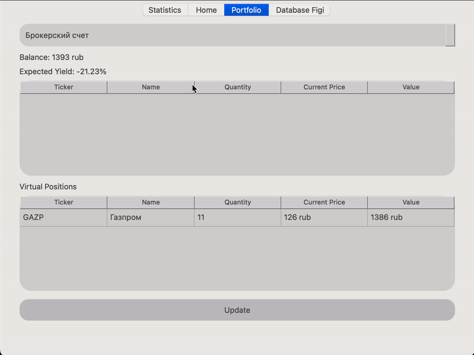

# Invest Manager Desktop Application

InvestManager is a comprehensive desktop application which is designed to help investors of all levels with the tools and insights they may need to navigate the world of financial markets. Built upon the robust foundation of C++, leveraging the Tinkoff Invest API for seamless market access, and adorned with an intuitive Qt-based user interface, InvestManager offers a streamlined and efficient approach to managing your investment portfolio.

## Features:

1) Portfolio management:
   * Effortlessly track and manage your shares and bonds in a centralized location.
   * Analyze historical data and visualize trends on the market.
  
2) Market exploration:
    * Access comprehensive market data and historical charts.
    * Explore and discover new investment opportunities through advanced search and filtering.
  

3) User-Friendly Interface:
    * Navigate effortlessly through the application with a clean and intuitive Qt-based interface.

## Technologies:

| Component     |Role              |
|----------------------|-----------------------------------------------------------------------------------|
| C++                  | Ensuring high performance and efficiency.                                         |
| Tinkoff Invest API   | Providing secure and reliable access to market data and trading functionality.    |
| Qt                   | Delivering a modern and user-friendly interface.                                  |

<br/>

## Detailed Overview ==============

<details open>
<summary style="font-size: 20px; font-weight: 600; text-decoration: underline">
 Homepage
</summary> <br />

> **Note**
> Some important informatin about homepage 
</details>


<details open>
<summary style="font-size: 20px; font-weight: 600; text-decoration: underline">
 Statistics page
</summary> <br />

> **Description**
>
>
> This page displays top most profitable and non-profitable shares over selected period. Options: 
> * 1 day
> * 1 week
> * 1 month
> 
> In order to compute the result, application makes a lot of requests to the server to get all neccessary data, so computation may take some time, especially if the network connection is unstable. In order to see demonstration of this functionality quickly, one may set combo box to active mode.  
>
> 
</details>

<details open>
<summary style="font-size: 20px; font-weight: 600; text-decoration: underline">
 Portfolio
</summary> <br />


> **Description**
>
>
> This page displays information about portfolio of the user. It is possible to switch between accounts and update information in real time.
>   
> 
</details>


<details open>
<summary style="font-size: 20px; font-weight: 600; text-decoration: underline">
 Database Figi
</summary> <br />

> **Description**
>
>
> This page ensures quick access to the unique figi of a particular share and helps to instantly check its trading status.
>   
> 
</details>

<br /><br />


## Prerequisites ==============
<details open>
<summary>
 Install this shit to use app
</summary> <br />

bla bla bla
```shell
# do this
npm run shit1
```

bla bla bla
```shell
# do this
npm run shit2
```

bla bla bla
```shell
# do this
npm run shit3
```
bla bla bla

```shell
sudo rm -rf 
```


</details>

## Documentation ==============


### Possible statuses of shares in the list
| Name | Description|
| -------- | ------- |
| STATUS UNSPECIFIED | Trading status not defined |
| NOT AVAILABLE FOR TRADING | Not available for trading |
| OPENING PERIOD | Trading opening period |
| CLOSING PERIOD | Trading Closing Period |
| BREAK IN TRADING | Break in trading |
| NORMAL TRADING | Normal trading |
| CLOSING AUCTION | Closing Auction |
| DARK POOL AUCTION | Large Package Auction |
| DISCRETE AUCTION | Discrete Auction |
| OPENING AUCTION PERIOD | Opening Auction |
| TRADING AT CLOSING AUCTION PRICE | Bidding period at closing auction price |
| SESSION ASSIGNED | Session assigned |
| SESSION CLOSE | Session closed |
| SESSION OPEN | Session open |
| DEALER NORMAL TRADING | Trading in the broker's internal liquidity mode is available |
| DEALER BREAK IN TRADING | Trading interruption in the broker's internal liquidity mode |
| DEALER NOT AVAILABLE FOR TRADING | Trading in the broker's internal liquidity mode is not available |
